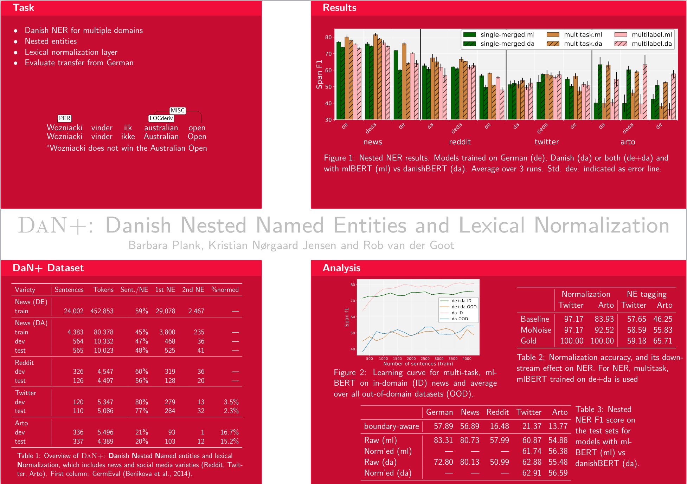

# DaN+ (DaNplus): Danish Nested Named Entities and Lexical Normalization

[](LICENSE)

<a href="DaNplus-poster.pdf"></a>

This repository contains the code and data for the paper [Nested NER and Lexical Normalization for Danish (DaN+)](https://www.aclweb.org/anthology/2020.coling-main.583/) by Plank, Nørgaard Jensen and van der Goot, 2020 (COLING).

## Nested Named Entity Recognition (NNER)

DaN+ contains Nested Named Entities with a 2-level annotation for four major entity types (ORG, PER, LOC, MISC) and two subtypes (-part and -deriv). 
An example from the training data is shown below. For further detail, see the supplementary material in the paper.


DaN+ contains data for cross-lingual cross-domain NNER evaluation. The Danish training material are NNER annotations on top of the [Danish DDT Universal Dependencies Treebank](https://universaldependencies.org/treebanks/da_ddt/index.html). Besides training material from the newswire domain, we provide three new evaluation web genres.


```
Og	O	O
jeg	O	O
er	O	O
bange	O	O
for	O	O
,	O	O
at	O	O
italienerne	B-LOCderiv	O
fra	O	O
Torino	B-LOC	O
er	O	O
de	O	O
klogeste	O	O
i	O	O
det	O	O
taktiske	O	O
spil	O	O
inden	O	O
onsdagens	O	O
kvartfinale	O	O
i	O	O
UEFA-turneringen	B-MISC	B-ORGpart
på	O	O
Gentoftes	B-LOC	O
tætpakkede	O	O
,	O	O
men	O	O
ikke	O	O
særlig	O	O
forbrugervenlige	O	O
Stadion	O	O
.	O	O
```

## Repository

In this repository you'll find:

* `configs`: configuration files for MaChAmp
* `data`: the data used in our paper
* `predictions`: the predictions for all experiments
* `scripts`: the code to reproduce all experiments. Look at scripts/runAll.sh on all commands necessary to rerun. Scripts/genAll.sh can be used to generate all tables/graphs used in the paper

Additionally, these scripts will download the following folders:

* `monoise`: MoNoise is a state-of-the-art lexical normalization model (van der Goot, 2019)
* `mtp`: Contains MaChAmp, a bert-based sequence labeler (van der Goot et al., 2020)

# References

If you use the code, data, guidelines from DaN+, please include the following references:

```
@inproceedings{plank-etal-2020-dan,
    title = "{D}a{N}+: {D}anish Nested Named Entities and Lexical Normalization",
    author = "Plank, Barbara  and
      Jensen, Kristian N{\o}rgaard  and
      van der Goot, Rob",
    booktitle = "Proceedings of the 28th International Conference on Computational Linguistics",
    month = dec,
    year = "2020",
    address = "Barcelona, Spain (Online)",
    publisher = "International Committee on Computational Linguistics",
    url = "https://www.aclweb.org/anthology/2020.coling-main.583",
    pages = "6649--6662"
}

```
```
@misc{goot2020massive,
    title={Massive Choice, Ample Tasks (MaChAmp): A Toolkit for Multi-task Learning in NLP},
    author={Rob van der Goot and Ahmet Üstün and Alan Ramponi and Barbara Plank},
    year={2020},
    eprint={2005.14672},
    archivePrefix={arXiv},
    primaryClass={cs.CL}
}
```

The Danish News data is based on (Johannsen et al., 2015):


```
    Johannsen, Anders, Martínez Alonso, Héctor and Plank, Barbara. “Universal Dependencies for Danish”. TLT14, 2015.

    Buch-Kromann, Matthias T., Line Mikkelsen, and Stine Kern Lynge. “Danish dependency treebank.”. TLT. 2003.

    Keson, Britt (1998). Documentation of The Danish Morpho-syntactically Tagged PAROLE Corpus. Technical report, DSL
```


